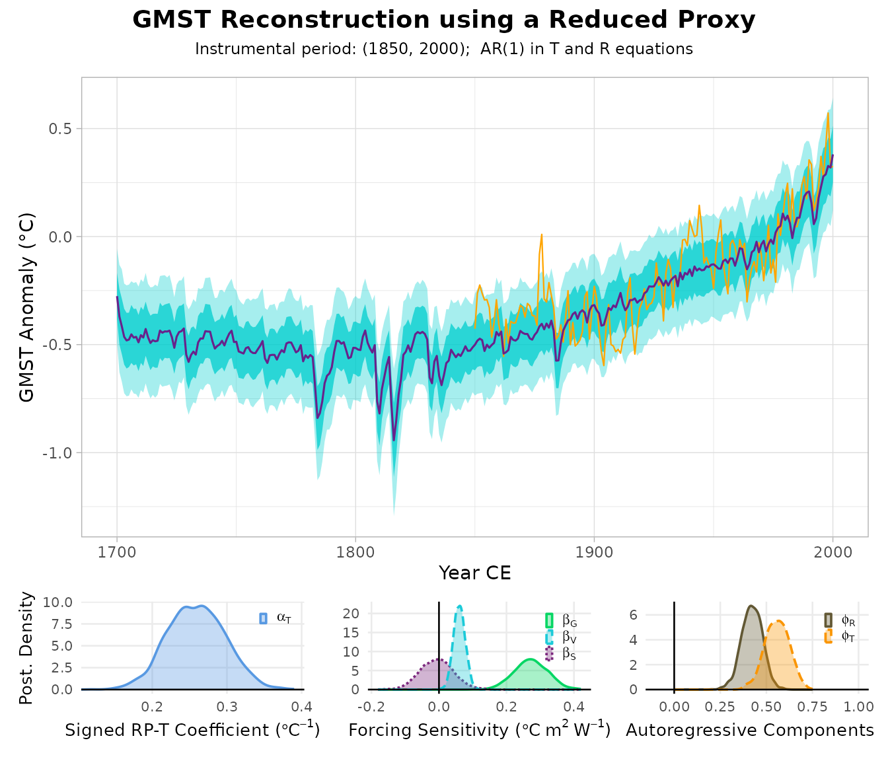
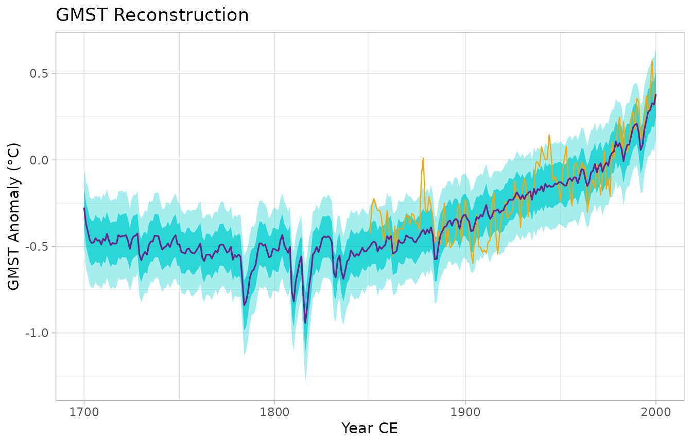
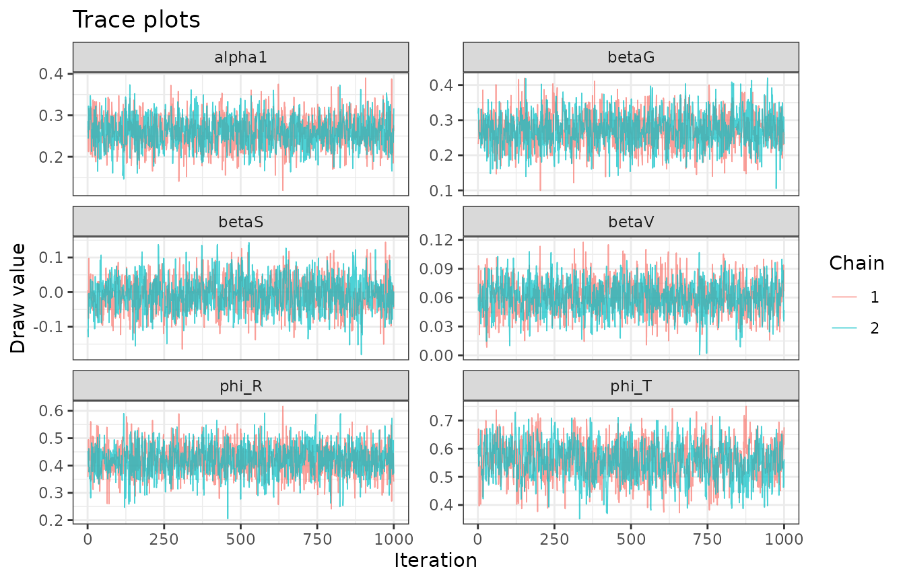
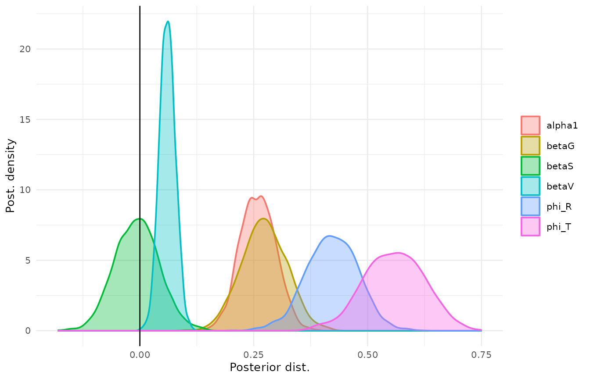
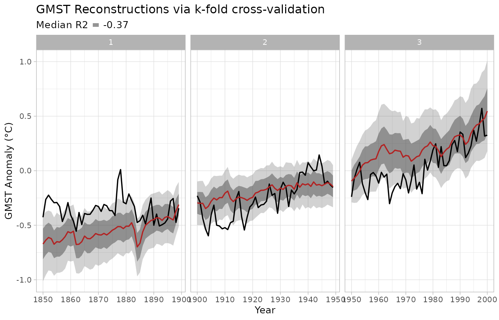

# Introduction to BayGMST

This vignette walks through the full BayGMST workflow end to end, using
small example datasets bundled with the package (trimmed subsets of the
data used in Bagwell et al., in prep.; see
`system.file("extdata", package = "BayGMST")`). It replaces the
`config.yml`-driven scripts the package was originally built from – see
`NEWS.md` and `system.file("legacy-scripts", package = "BayGMST")`.

``` r

library(BayGMST)
```

## 1. Load example data

``` r

proxy_matrix <- read.csv(
  system.file("extdata", "example_proxy_matrix.csv", package = "BayGMST")
)
forcing_raw <- read.csv(
  system.file("extdata", "example_forcing.csv", package = "BayGMST")
)
instrumental_raw <- read.csv(
  system.file("extdata", "example_instrumental_temperature.csv", package = "BayGMST")
)
# read.csv() mangles "Time"/"Anomaly (deg C)" headers via make.names(); give
# them stable names instead of relying on the mangled spelling.
colnames(instrumental_raw)[1:2] <- c("Time", "Anomaly")

years <- forcing_raw$year
head(proxy_matrix)
#>   year SAm_030  SAm_026 SAm_025 Ocn_095 NAm_186 NAm_104
#> 1 1700  9.2943 -20.9760   0.463 -4.5324   0.652   1.021
#> 2 1701  9.2947 -18.8329   0.474 -4.6960   0.577   0.941
#> 3 1702  9.2951 -18.7600   0.660 -4.6556   0.831   0.982
#> 4 1703  9.2955 -19.9733   0.980 -4.3724   1.045   0.994
#> 5 1704  9.2959 -19.9486   0.735 -4.4295   0.876   0.973
#> 6 1705  9.2963 -21.1983  -0.357 -4.6110   0.672   0.990
```

## 2. Reduce the proxy network to a single representative series

``` r

calib_years <- instrumental_raw$Time

rp <- reduce_proxies(
  proxy_matrix = proxy_matrix[, -1],
  years        = proxy_matrix$year,
  temp_calib   = instrumental_raw$Anomaly,
  calib_years  = calib_years,
  method       = "PCR",
  # `chunk` must be large enough that every segment (including the last,
  # shortest one) still fully contains the calibration window (1850-2000,
  # 151 years). This toy example only has 301 years total, so we use a
  # single segment (chunk >= length(years)) rather than the package
  # default of 250, which would create a too-short trailing segment here.
  chunk        = nrow(proxy_matrix)
)
rp
#> <baygmst_rp>
#>   Method:   PCR
#>   Years:    1700 to 2000 (n = 301)
#>   Segments: 1
#>   Pass to fit_baygmst() directly, or use x$composite$RP1.
```

`rp` can be passed to
[`fit_baygmst()`](https://paleopresto.github.io/BayGMST_R/reference/fit_baygmst.md)
directly (it is aligned to the model’s year grid by calendar year, via
[`as_baygmst_proxy()`](https://paleopresto.github.io/BayGMST_R/reference/as_baygmst_proxy.md));
the raw series lives in `rp$composite$RP1` if you need it. You do not
have to use
[`reduce_proxies()`](https://paleopresto.github.io/BayGMST_R/reference/reduce_proxies.md)
at all – any reduced or composited proxy series works here; see “Using
composites from other packages” below.

## 3. Transform the radiative forcings

``` r

forcing <- transform_forcings(
  G = forcing_raw$CO2,
  V = forcing_raw$volcanic,
  S = forcing_raw$solar
)
```

## 4. Align everything onto the common year grid and fit the model

The proxy series is aligned automatically (by calendar year) when you
pass the
[`reduce_proxies()`](https://paleopresto.github.io/BayGMST_R/reference/reduce_proxies.md)
output itself; the instrumental series still needs aligning onto `years`
by hand, with `NA` marking the pre-instrumental years the model will
reconstruct:

``` r

instrumental_T <- instrumental_raw$Anomaly[match(years, instrumental_raw$Time)]
```

Fitting requires a working CmdStan installation (via / ); see
[`vignette("cmdstanr", package = "cmdstanr")`](https://mc-stan.org/cmdstanr/articles/cmdstanr.html)
if you don’t have one yet. The chunk below is skipped if none is found.

``` r

fit <- fit_baygmst(
  proxy          = rp,
  instrumental_T = instrumental_T,
  forcing_G      = forcing$G,
  forcing_V      = forcing$V,
  forcing_S      = forcing$S,
  years          = years,
  chains         = 2,
  parallel_chains = 2,
  iter_warmup    = 300,
  iter_sampling  = 1000,
  seed           = 1
)
#> Running MCMC with 2 parallel chains...
#> 
#> Chain 1 Iteration:    1 / 1300 [  0%]  (Warmup) 
#> Chain 2 Iteration:    1 / 1300 [  0%]  (Warmup) 
#> Chain 1 Iteration:  100 / 1300 [  7%]  (Warmup) 
#> Chain 1 Iteration:  200 / 1300 [ 15%]  (Warmup) 
#> Chain 2 Iteration:  100 / 1300 [  7%]  (Warmup) 
#> Chain 1 Iteration:  300 / 1300 [ 23%]  (Warmup) 
#> Chain 1 Iteration:  301 / 1300 [ 23%]  (Sampling) 
#> Chain 2 Iteration:  200 / 1300 [ 15%]  (Warmup) 
#> Chain 1 Iteration:  400 / 1300 [ 30%]  (Sampling) 
#> Chain 2 Iteration:  300 / 1300 [ 23%]  (Warmup) 
#> Chain 2 Iteration:  301 / 1300 [ 23%]  (Sampling) 
#> Chain 1 Iteration:  500 / 1300 [ 38%]  (Sampling) 
#> Chain 2 Iteration:  400 / 1300 [ 30%]  (Sampling) 
#> Chain 1 Iteration:  600 / 1300 [ 46%]  (Sampling) 
#> Chain 2 Iteration:  500 / 1300 [ 38%]  (Sampling) 
#> Chain 2 Iteration:  600 / 1300 [ 46%]  (Sampling) 
#> Chain 1 Iteration:  700 / 1300 [ 53%]  (Sampling) 
#> Chain 2 Iteration:  700 / 1300 [ 53%]  (Sampling) 
#> Chain 1 Iteration:  800 / 1300 [ 61%]  (Sampling) 
#> Chain 2 Iteration:  800 / 1300 [ 61%]  (Sampling) 
#> Chain 1 Iteration:  900 / 1300 [ 69%]  (Sampling) 
#> Chain 2 Iteration:  900 / 1300 [ 69%]  (Sampling) 
#> Chain 1 Iteration: 1000 / 1300 [ 76%]  (Sampling) 
#> Chain 2 Iteration: 1000 / 1300 [ 76%]  (Sampling) 
#> Chain 1 Iteration: 1100 / 1300 [ 84%]  (Sampling) 
#> Chain 2 Iteration: 1100 / 1300 [ 84%]  (Sampling) 
#> Chain 1 Iteration: 1200 / 1300 [ 92%]  (Sampling) 
#> Chain 2 Iteration: 1200 / 1300 [ 92%]  (Sampling) 
#> Chain 1 Iteration: 1300 / 1300 [100%]  (Sampling) 
#> Chain 2 Iteration: 1300 / 1300 [100%]  (Sampling) 
#> Chain 1 finished in 2.9 seconds.
#> Chain 2 finished in 2.9 seconds.
#> 
#> Both chains finished successfully.
#> Mean chain execution time: 2.9 seconds.
#> Total execution time: 3.0 seconds.
summary(fit)
#> Posterior parameter summary:
#>    variable         mean       median          sd         mad          q5
#> 1    alpha0 -0.065028365 -0.065352501 0.012581323 0.012354588 -0.08519683
#> 2    alpha1  0.259176863  0.259394285 0.038686100 0.039645569  0.19843176
#> 3     phi_R  0.421939053  0.422557005 0.056391144 0.057185328  0.33135071
#> 4     phi_T  0.557697091  0.558897910 0.066156538 0.068346622  0.44977236
#> 5     beta0 -0.203017805 -0.203466845 0.033991214 0.035376697 -0.25942460
#> 6     betaG  0.272715339  0.272000680 0.049631559 0.049397356  0.19069658
#> 7     betaS -0.006414658 -0.006468269 0.048658313 0.049626635 -0.08546052
#> 8     betaV  0.060345789  0.060124152 0.017424434 0.017244751  0.03208148
#> 9   sigma_y  0.103982659  0.103674475 0.006032221 0.005968366  0.09467305
#> 10  sigma_z  0.112829340  0.112775265 0.004726679 0.004596357  0.10514527
#>            q95      rhat  ess_bulk ess_tail
#> 1  -0.04372216 1.0027969 2656.2336 1384.502
#> 2   0.32287198 1.0021939 1374.3605 1461.680
#> 3   0.51107871 1.0002487 1794.0149 1732.952
#> 4   0.66394920 1.0022826  767.3195 1329.076
#> 5  -0.14860656 1.0037575  817.0683 1555.701
#> 6   0.35314789 1.0013899 1357.8888 1499.608
#> 7   0.07405890 1.0001183 1106.6513 1308.938
#> 8   0.08934192 0.9996564 1352.0124 1499.242
#> 9   0.11445876 1.0010497  916.8057 1372.267
#> 10  0.12082047 1.0051395 2550.9664 1327.587
#> 
#> Instrumental-period fit performance:
#>      RMSE       MAE        Bias Correlation        R2 R2_detrended
#>  0.130152 0.1064078 -0.03095854   0.8547477 0.7305936    0.3518489
```

## 5. Visualize the reconstruction

[`plot()`](https://rdrr.io/r/graphics/plot.default.html) on a fitted
model draws the summary figure used in the PReSto manuscript: the
reconstruction on top and the posterior densities of the model
parameters below (this needs the ‘patchwork’ package).

``` r

plot(fit)
```



The panels are also available individually:

``` r

plot_reconstruction(fit)
```



``` r

plot_trace(fit)
```



``` r

plot_posterior_densities(fit)
```



## 6. Cross-validate

``` r

cv <- cv_baygmst(
  proxy          = rp,
  instrumental_T = instrumental_T,
  forcing_G      = forcing$G,
  forcing_V      = forcing$V,
  forcing_S      = forcing$S,
  years          = years,
  nfold          = 3,
  chains         = 2,
  parallel_chains = 2,
  iter_warmup    = 300,
  iter_sampling  = 1000,
  seed           = 1
)
#> Running MCMC with 2 parallel chains...
#> 
#> Chain 1 Iteration:    1 / 1300 [  0%]  (Warmup) 
#> Chain 2 Iteration:    1 / 1300 [  0%]  (Warmup)
#> Chain 2 Informational Message: The current Metropolis proposal is about to be rejected because of the following issue:
#> Chain 2 Exception: normal_lpdf: Scale parameter is 0, but must be positive! (in '/tmp/Rtmp53IqqQ/model-1caf7952876a.stan', line 75, column 2 to column 40)
#> Chain 2 If this warning occurs sporadically, such as for highly constrained variable types like covariance matrices, then the sampler is fine,
#> Chain 2 but if this warning occurs often then your model may be either severely ill-conditioned or misspecified.
#> Chain 2
#> Chain 1 Iteration:  100 / 1300 [  7%]  (Warmup) 
#> Chain 2 Iteration:  100 / 1300 [  7%]  (Warmup) 
#> Chain 2 Iteration:  200 / 1300 [ 15%]  (Warmup) 
#> Chain 1 Iteration:  200 / 1300 [ 15%]  (Warmup) 
#> Chain 1 Iteration:  300 / 1300 [ 23%]  (Warmup) 
#> Chain 1 Iteration:  301 / 1300 [ 23%]  (Sampling) 
#> Chain 2 Iteration:  300 / 1300 [ 23%]  (Warmup) 
#> Chain 2 Iteration:  301 / 1300 [ 23%]  (Sampling) 
#> Chain 2 Iteration:  400 / 1300 [ 30%]  (Sampling) 
#> Chain 1 Iteration:  400 / 1300 [ 30%]  (Sampling) 
#> Chain 2 Iteration:  500 / 1300 [ 38%]  (Sampling) 
#> Chain 1 Iteration:  500 / 1300 [ 38%]  (Sampling) 
#> Chain 2 Iteration:  600 / 1300 [ 46%]  (Sampling) 
#> Chain 1 Iteration:  600 / 1300 [ 46%]  (Sampling) 
#> Chain 2 Iteration:  700 / 1300 [ 53%]  (Sampling) 
#> Chain 1 Iteration:  700 / 1300 [ 53%]  (Sampling) 
#> Chain 2 Iteration:  800 / 1300 [ 61%]  (Sampling) 
#> Chain 1 Iteration:  800 / 1300 [ 61%]  (Sampling) 
#> Chain 2 Iteration:  900 / 1300 [ 69%]  (Sampling) 
#> Chain 2 Iteration: 1000 / 1300 [ 76%]  (Sampling) 
#> Chain 1 Iteration:  900 / 1300 [ 69%]  (Sampling) 
#> Chain 2 Iteration: 1100 / 1300 [ 84%]  (Sampling) 
#> Chain 1 Iteration: 1000 / 1300 [ 76%]  (Sampling) 
#> Chain 2 Iteration: 1200 / 1300 [ 92%]  (Sampling) 
#> Chain 1 Iteration: 1100 / 1300 [ 84%]  (Sampling) 
#> Chain 2 Iteration: 1300 / 1300 [100%]  (Sampling) 
#> Chain 2 finished in 3.7 seconds.
#> Chain 1 Iteration: 1200 / 1300 [ 92%]  (Sampling) 
#> Chain 1 Iteration: 1300 / 1300 [100%]  (Sampling) 
#> Chain 1 finished in 4.2 seconds.
#> 
#> Both chains finished successfully.
#> Mean chain execution time: 3.9 seconds.
#> Total execution time: 4.2 seconds.
#> 
#> Running MCMC with 2 parallel chains...
#> 
#> Chain 1 Iteration:    1 / 1300 [  0%]  (Warmup) 
#> Chain 2 Iteration:    1 / 1300 [  0%]  (Warmup)
#> Chain 2 Informational Message: The current Metropolis proposal is about to be rejected because of the following issue:
#> Chain 2 Exception: normal_lpdf: Scale parameter is 0, but must be positive! (in '/tmp/Rtmp53IqqQ/model-1caf7952876a.stan', line 75, column 2 to column 40)
#> Chain 2 If this warning occurs sporadically, such as for highly constrained variable types like covariance matrices, then the sampler is fine,
#> Chain 2 but if this warning occurs often then your model may be either severely ill-conditioned or misspecified.
#> Chain 2
#> Chain 2 Iteration:  100 / 1300 [  7%]  (Warmup) 
#> Chain 2 Iteration:  200 / 1300 [ 15%]  (Warmup) 
#> Chain 2 Iteration:  300 / 1300 [ 23%]  (Warmup) 
#> Chain 2 Iteration:  301 / 1300 [ 23%]  (Sampling) 
#> Chain 1 Iteration:  100 / 1300 [  7%]  (Warmup) 
#> Chain 2 Iteration:  400 / 1300 [ 30%]  (Sampling) 
#> Chain 2 Iteration:  500 / 1300 [ 38%]  (Sampling) 
#> Chain 2 Iteration:  600 / 1300 [ 46%]  (Sampling) 
#> Chain 2 Iteration:  700 / 1300 [ 53%]  (Sampling) 
#> Chain 2 Iteration:  800 / 1300 [ 61%]  (Sampling) 
#> Chain 1 Iteration:  200 / 1300 [ 15%]  (Warmup) 
#> Chain 2 Iteration:  900 / 1300 [ 69%]  (Sampling) 
#> Chain 2 Iteration: 1000 / 1300 [ 76%]  (Sampling) 
#> Chain 2 Iteration: 1100 / 1300 [ 84%]  (Sampling) 
#> Chain 2 Iteration: 1200 / 1300 [ 92%]  (Sampling) 
#> Chain 1 Iteration:  300 / 1300 [ 23%]  (Warmup) 
#> Chain 1 Iteration:  301 / 1300 [ 23%]  (Sampling) 
#> Chain 2 Iteration: 1300 / 1300 [100%]  (Sampling) 
#> Chain 2 finished in 2.0 seconds.
#> Chain 1 Iteration:  400 / 1300 [ 30%]  (Sampling) 
#> Chain 1 Iteration:  500 / 1300 [ 38%]  (Sampling) 
#> Chain 1 Iteration:  600 / 1300 [ 46%]  (Sampling) 
#> Chain 1 Iteration:  700 / 1300 [ 53%]  (Sampling) 
#> Chain 1 Iteration:  800 / 1300 [ 61%]  (Sampling) 
#> Chain 1 Iteration:  900 / 1300 [ 69%]  (Sampling) 
#> Chain 1 Iteration: 1000 / 1300 [ 76%]  (Sampling) 
#> Chain 1 Iteration: 1100 / 1300 [ 84%]  (Sampling) 
#> Chain 1 Iteration: 1200 / 1300 [ 92%]  (Sampling) 
#> Chain 1 Iteration: 1300 / 1300 [100%]  (Sampling) 
#> Chain 1 finished in 3.3 seconds.
#> 
#> Both chains finished successfully.
#> Mean chain execution time: 2.6 seconds.
#> Total execution time: 3.4 seconds.
#> 
#> Running MCMC with 2 parallel chains...
#> 
#> Chain 1 Iteration:    1 / 1300 [  0%]  (Warmup) 
#> Chain 2 Iteration:    1 / 1300 [  0%]  (Warmup)
#> Chain 2 Informational Message: The current Metropolis proposal is about to be rejected because of the following issue:
#> Chain 2 Exception: normal_lpdf: Scale parameter is 0, but must be positive! (in '/tmp/Rtmp53IqqQ/model-1caf7952876a.stan', line 75, column 2 to column 40)
#> Chain 2 If this warning occurs sporadically, such as for highly constrained variable types like covariance matrices, then the sampler is fine,
#> Chain 2 but if this warning occurs often then your model may be either severely ill-conditioned or misspecified.
#> Chain 2
#> Chain 1 Iteration:  100 / 1300 [  7%]  (Warmup) 
#> Chain 2 Iteration:  100 / 1300 [  7%]  (Warmup) 
#> Chain 1 Iteration:  200 / 1300 [ 15%]  (Warmup) 
#> Chain 2 Iteration:  200 / 1300 [ 15%]  (Warmup) 
#> Chain 2 Iteration:  300 / 1300 [ 23%]  (Warmup) 
#> Chain 2 Iteration:  301 / 1300 [ 23%]  (Sampling) 
#> Chain 1 Iteration:  300 / 1300 [ 23%]  (Warmup) 
#> Chain 1 Iteration:  301 / 1300 [ 23%]  (Sampling) 
#> Chain 2 Iteration:  400 / 1300 [ 30%]  (Sampling) 
#> Chain 1 Iteration:  400 / 1300 [ 30%]  (Sampling) 
#> Chain 2 Iteration:  500 / 1300 [ 38%]  (Sampling) 
#> Chain 1 Iteration:  500 / 1300 [ 38%]  (Sampling) 
#> Chain 2 Iteration:  600 / 1300 [ 46%]  (Sampling) 
#> Chain 1 Iteration:  600 / 1300 [ 46%]  (Sampling) 
#> Chain 2 Iteration:  700 / 1300 [ 53%]  (Sampling) 
#> Chain 1 Iteration:  700 / 1300 [ 53%]  (Sampling) 
#> Chain 2 Iteration:  800 / 1300 [ 61%]  (Sampling) 
#> Chain 1 Iteration:  800 / 1300 [ 61%]  (Sampling) 
#> Chain 2 Iteration:  900 / 1300 [ 69%]  (Sampling) 
#> Chain 1 Iteration:  900 / 1300 [ 69%]  (Sampling) 
#> Chain 2 Iteration: 1000 / 1300 [ 76%]  (Sampling) 
#> Chain 1 Iteration: 1000 / 1300 [ 76%]  (Sampling) 
#> Chain 2 Iteration: 1100 / 1300 [ 84%]  (Sampling) 
#> Chain 1 Iteration: 1100 / 1300 [ 84%]  (Sampling) 
#> Chain 2 Iteration: 1200 / 1300 [ 92%]  (Sampling) 
#> Chain 1 Iteration: 1200 / 1300 [ 92%]  (Sampling) 
#> Chain 2 Iteration: 1300 / 1300 [100%]  (Sampling) 
#> Chain 2 finished in 3.7 seconds.
#> Chain 1 Iteration: 1300 / 1300 [100%]  (Sampling) 
#> Chain 1 finished in 4.0 seconds.
#> 
#> Both chains finished successfully.
#> Mean chain execution time: 3.9 seconds.
#> Total execution time: 4.1 seconds.
cv
#> <baygmst_cv>
#>   Folds:  3
#>   R2 (posterior mean, per fold): -4.11, 0.24, -0.37
#>   Median R2: -0.37
plot_cv(cv)
```



## 7. Using composites from other packages

[`reduce_proxies()`](https://paleopresto.github.io/BayGMST_R/reference/reduce_proxies.md)
is one way to produce the model’s proxy input, but not the only one.
[`fit_baygmst()`](https://paleopresto.github.io/BayGMST_R/reference/fit_baygmst.md)’s
proxy equation estimates its own intercept and slope against
temperature, so any reduced or composited proxy series on a reasonable
scale works – a standardized (z-score) composite or a
temperature-anomaly-scale series is appropriate; a raw-unit series with
large numerical magnitude should be standardized first.

[`as_baygmst_proxy()`](https://paleopresto.github.io/BayGMST_R/reference/as_baygmst_proxy.md)
normalizes the common shapes such a series arrives in. In particular, it
accepts composite objects of the shape produced by compositing packages
in the LiPD ecosystem (such as the in-development
[compositeR](https://github.com/nickmckay/compositeR) package, whose
`compositeEnsembles2()` is the intended primary pathway for building
BayGMST inputs from paleoclimate data): a list carrying `$ages` (in
years BP, i.e. before 1950 CE) and `$composite` (rows = time steps,
columns = ensemble members). Here is a synthetic stand-in:

``` r

set.seed(1)
composite_ens <- list(
  ages      = seq(250, -50, by = -1),               # 1700-2000 CE, in yr BP
  composite = matrix(rnorm(301 * 50, sd = 0.2), 301, 50) +
    seq(-0.2, 0.4, length.out = 301)                # 50 ensemble members
)

proxy_input <- as_baygmst_proxy(composite_ens)
proxy_input
#> <baygmst_proxy>
#>   Source:  composite (50 members, median; ages BP)
#>   Years:   1700 to 2000 CE (n = 301)
#>   Ensemble: collapsed from 50 members
#>   Range:   [-0.247, 0.487]
```

Ages are converted to calendar years and the ensemble is collapsed to
its median series (compositing uncertainty is therefore not yet
propagated into the posterior; the object records `n_ensemble` so this
can become an ensemble-aware pathway in a future release). The result
can be passed straight to `fit_baygmst(proxy = proxy_input, ...)`, which
aligns it to `years` by calendar year and errors informatively if any
requested year is not covered. Bare numeric vectors, `data.frame`s with
year and value columns, and time-by-ensemble matrices work the same way
– see
[`?as_baygmst_proxy`](https://paleopresto.github.io/BayGMST_R/reference/as_baygmst_proxy.md).

## Known limitations

See `NEWS.md` for the modeling decisions and known limitations of this
release (for example, `reduce_proxies(method = "SIR")` is experimental).
The data in this vignette are synthetic, so its reconstructions should
not be over-interpreted.
